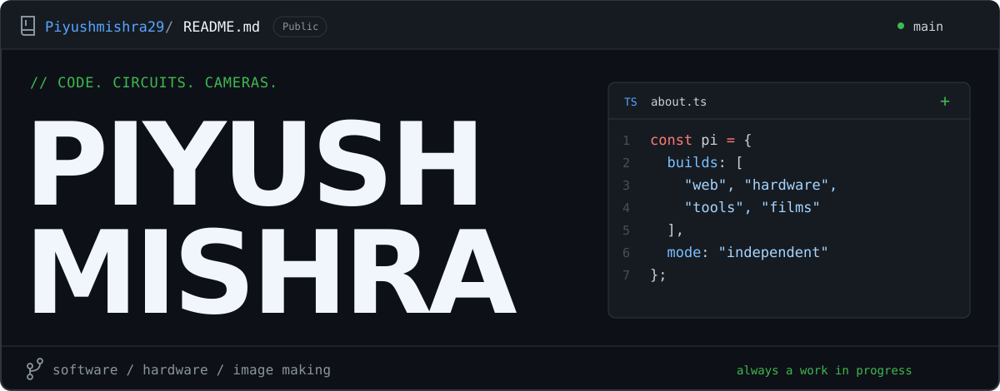
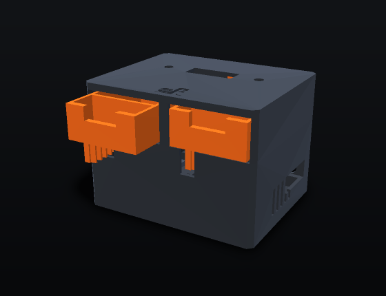

  

### I build things. Some of them stay on the internet.

I'm **Piyush — Pi for short.** I work across code, cameras, and physical hardware. Cinematic websites, custom electronics, self-hosted tools, things that come off a 3D printer. I tend to follow a project wherever it goes.

A steel factory, a surf school, a hacked Kindle, a motorised drawer. Same person.

[**Selected work ↓**](#selected-work) &nbsp; / &nbsp; [**The archive ↓**](#the-archive) &nbsp; / &nbsp; [**All repositories ↗**](https://github.com/Piyushmishra29?tab=repositories)

## Selected work

<table>
<tr>
<td width="100%" valign="top">

<h3><a href="https://github.com/Piyushmishra29/shopkeeper">Shopkeeper ↗</a></h3>

Enter a PIN. A drawer opens. The pick gets logged. A working tool-cabinet demonstrator built from firmware and filament.

ESP32 / MICROPYTHON / PARAMETRIC CAD
</td>
</tr>
</table>

| Build | What it does |
| :--- | :--- |
| [**Liquid Storefront ↗**](https://github.com/Piyushmishra29/liquid-storefront) | Runs a Shopify theme on your own server. Cart, admin, payments, your data. |
| [**NPK Dash ↗**](https://github.com/Piyushmishra29/npk-dash) | Turns a real soil probe's Modbus registers into a live dashboard. |
| [**Reel Edit Pipeline ↗**](https://github.com/Piyushmishra29/reel-edit-pipeline) | Turns event and drone footage into beat-synced reels with GPU rendering. |

ALSO: <a href="https://github.com/Piyushmishra29/paperwitch">a Kindle with other plans</a> · <a href="https://github.com/Piyushmishra29/mete">a dot-matrix focus timer</a> · <a href="https://github.com/Piyushmishra29/bing-bong">an airline chime for finished prompts</a>

 

**On the bench** 
TypeScript · Python · React / Next.js · Node.js · Three.js · GSAP · PostgreSQL 
ESP32 · Raspberry Pi · CAD · 3D printing · FFmpeg

## The archive

<b>Hardware & fabrication</b> — software leaves the screen

| Project | The idea |
| :--- | :--- |
| [Shopkeeper](https://github.com/Piyushmishra29/shopkeeper) | PIN-controlled motorised tool-cabinet demonstrator |
| [OPS Sensor Unit](https://github.com/Piyushmishra29/ops-sensor-unit) | ESP32 desk monitor in a custom printed enclosure |
| [NPK Dash](https://github.com/Piyushmishra29/npk-dash) | Live soil-probe readings over Modbus |
| [Pi Weather Ops](https://github.com/Piyushmishra29/pi-weather-ops) | A Raspberry Pi sensor dashboard dressed as an ops panel |
| [Biome Mini](https://github.com/Piyushmishra29/biome-mini) | A tiny OLED watching the air and a thirsty plant |
| [Gridfinity Drawer](https://github.com/Piyushmishra29/gridfinity-drawer) | Parametric baseplates made to fit an actual drawer |
| [Paperwitch](https://github.com/Piyushmishra29/paperwitch) | Kindle hacks, tools, and dashboard configs |

<b>Tools & experiments</b> — commerce, creative pipelines, small joys

| Project | The idea |
| :--- | :--- |
| [Liquid Storefront](https://github.com/Piyushmishra29/liquid-storefront) | A Shopify theme export, running on your own server |
| [Reel Edit Pipeline](https://github.com/Piyushmishra29/reel-edit-pipeline) | GPU-powered, beat-synced video editing |
| [Mete](https://github.com/Piyushmishra29/mete) | A dot-matrix focus timer for Mac and Chrome |
| [Bing Bong](https://github.com/Piyushmishra29/bing-bong) | An airline cabin chime when Claude Code finishes |

<b>Surf & travel</b> — surf, travel, identities

| Project | The idea |
| :--- | :--- |
| [Tuk & Tide Surf Club](https://github.com/Piyushmishra29/tuk-and-tide-surf-club) | A heritage identity, brand book, and sticker collection |
| [Bro Knows A Spot](https://github.com/Piyushmishra29/bro-knows-a-spot) | A sunburst identity for a travel company |
| [South Coast '26](https://github.com/Piyushmishra29/south-coast-26) | A zine-inspired Sri Lanka trip website |

