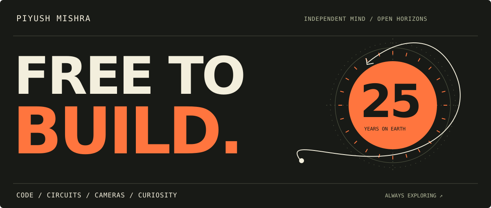

  

# Hey, I'm Piyush. Call me Pi.

**25. A free man with a soldering iron, a camera, and too many ideas to leave unbuilt.**

I make websites that move, hardware that moves, and tools that get the boring stuff out of the way. My repos wander from steel factories to surf schools, from tiny sensor screens to entire storefronts. I like following an idea all the way into something you can use, hold, or get a little distracted by.

Some days it's TypeScript. Some days it's filament. Occasionally, it's an airline chime.

**[Explore the builds ↓](#a-few-good-rabbit-holes)** &nbsp; / &nbsp; **[Browse the collection ↓](#the-rest-of-the-workshop)**

---

## A few good rabbit holes

<table>
<tr>
<td width="50%" valign="top">
<h3>01 / The web, with a pulse</h3>
<a href="https://github.com/Piyushmishra29/ommi-forge-web"><b>Ommi Forge ↗</b></a>

A steel-forging company's story told through scroll choreography and nine interactive 3D parts. Heavy industry, with a cinematic eye.

Next.js · React Three Fiber · GSAP
</td>
<td width="50%" valign="top">
<h3>02 / Code you can hold</h3>
<a href="https://github.com/Piyushmishra29/shopkeeper"><b>Shopkeeper ↗</b></a>

A working motorised tool-cabinet demonstrator. Enter a PIN, one drawer opens, and the pick gets logged. Firmware meets filament.

ESP32-S3 · MicroPython · Parametric CAD
</td>
</tr>
<tr>
<td width="50%" valign="top">
<h3>03 / Own your storefront</h3>
<a href="https://github.com/Piyushmishra29/liquid-storefront"><b>Liquid Storefront ↗</b></a>

A self-hosted engine for Shopify theme exports, with a cart, admin, payments, and your own data. Born from getting a real store back online.

Node.js · LiquidJS · PostgreSQL · Razorpay
</td>
<td width="50%" valign="top">
<h3>04 / A little field science</h3>
<a href="https://github.com/Piyushmishra29/npk-dash"><b>NPK Dash ↗</b></a>

A real soil probe, a live dashboard, and the register-map detective work that connects them. Getting my hands dirty, quite literally.

Python · RS-485 · Modbus RTU
</td>
</tr>
<tr>
<td width="50%" valign="top">
<h3>05 / Footage into feeling</h3>
<a href="https://github.com/Piyushmishra29/reel-edit-pipeline"><b>Reel Edit Pipeline ↗</b></a>

Raw event and drone footage into beat-synced reels. Detect shaky clips, cut to the music, and let the GPU do the heavy lifting.

Python · FFmpeg · NVENC · librosa
</td>
<td width="50%" valign="top">
<h3>06 / Take the scenic route</h3>
<a href="https://github.com/Piyushmishra29/surfing-ants"><b>Surfing Ants ↗</b></a>

A surf-school website for Weligama Bay with a live surf report and a beach-shack identity. A weather station with sand between its toes.

Next.js · Open-Meteo · Sri Lanka
</td>
</tr>
</table>

## Things I keep coming back to

**Make it feel good.** Typography, motion, a satisfying interaction. The details are part of the build.

**Make it tangible.** A printed enclosure, a moving drawer, a sensor reading something real.

**Make room for fun.** A hacked Kindle, a dot-matrix timer, or a tiny chime that makes finishing a task feel like landing a plane.

**Tools on the bench:** JavaScript / TypeScript · React / Next.js · Python · Node.js · Three.js / R3F · GSAP · PostgreSQL · ESP32 / Raspberry Pi · CAD / 3D printing · FFmpeg

## The rest of the workshop

<b>Websites with a point of view</b> — coffee, cinema, people, places

| Project | The idea |
| :--- | :--- |
| [Ommi Forge](https://github.com/Piyushmishra29/ommi-forge-web) | Steel, motion, and interactive 3D |
| [Base Coffee](https://github.com/Piyushmishra29/base-coffee) | A neighbourhood café, told through its own footage |
| [VibeCheck](https://github.com/Piyushmishra29/vibecheck-ind) | Culture and nightlife through a wall of reels |
| [TOP Marketing](https://github.com/Piyushmishra29/top-marketing-web) | A motion-led agency site with a draggable poster wall |
| [Quick Films](https://github.com/Piyushmishra29/quick-films) | A home for a video-editing and short-film studio |
| [Siffaat Spotlight](https://github.com/Piyushmishra29/siffat-spotlight) | An actor portfolio with a magazine sensibility |
| [Rishima](https://github.com/Piyushmishra29/rishima-web) | A soft, editorial portfolio for a marketer and creator |
| [Hinterland](https://github.com/Piyushmishra29/hinterland) | An eco-stay website with scroll-driven atmosphere |
| [Mount Wood](https://github.com/Piyushmishra29/mountwood) | A nature-stay site from the coffee estates of Coorg |

<b>Circuits, sensors & printed things</b> — software leaves the screen

| Project | The idea |
| :--- | :--- |
| [Shopkeeper](https://github.com/Piyushmishra29/shopkeeper) | PIN-controlled motorised tool-cabinet demonstrator |
| [OPS Sensor Unit](https://github.com/Piyushmishra29/ops-sensor-unit) | ESP32 desk monitor in a custom printed enclosure |
| [NPK Dash](https://github.com/Piyushmishra29/npk-dash) | Live soil-probe readings over Modbus |
| [Pi Weather Ops](https://github.com/Piyushmishra29/pi-weather-ops) | A Raspberry Pi sensor dashboard dressed as an ops panel |
| [Biome Mini](https://github.com/Piyushmishra29/biome-mini) | A tiny OLED watching the air and a thirsty plant |
| [Gridfinity Drawer](https://github.com/Piyushmishra29/gridfinity-drawer) | Parametric baseplates made to fit an actual drawer |
| [Paperwitch](https://github.com/Piyushmishra29/paperwitch) | Kindle hacks, tools, and dashboard configs |

<b>Useful tools & delightful detours</b> — commerce, creative pipelines, small joys

| Project | The idea |
| :--- | :--- |
| [Liquid Storefront](https://github.com/Piyushmishra29/liquid-storefront) | A Shopify theme export, running on your own server |
| [Reel Edit Pipeline](https://github.com/Piyushmishra29/reel-edit-pipeline) | GPU-powered, beat-synced video editing |
| [Poster Pipeline](https://github.com/Piyushmishra29/poster-pipeline) | HTML and CSS into print-ready A3 posters |
| [Mete](https://github.com/Piyushmishra29/mete) | A dot-matrix focus timer for Mac and Chrome |
| [Bing Bong](https://github.com/Piyushmishra29/bing-bong) | An airline cabin chime when Claude Code finishes |
| [Mahjong at Fia's](https://github.com/Piyushmishra29/mahjong-at-fias) | A lounge reservation prototype in a single HTML file |
| [Hike Proposal](https://github.com/Piyushmishra29/hike-proposal) | An enthusiastically over-engineered invitation |
| [AfterHour](https://github.com/Piyushmishra29/afterhour) | Product plans for a connected live-entertainment platform |
| [Switchkart Sprint](https://github.com/Piyushmishra29/switchkart-storefront-sprint) | Storefront audit, scope, and search-visibility planning |

<b>Saltwater & the scenic route</b> — surf, travel, identities

| Project | The idea |
| :--- | :--- |
| [Surfing Ants](https://github.com/Piyushmishra29/surfing-ants) | Weligama surf school with a live ocean report |
| [Alpha Ocean Hub](https://github.com/Piyushmishra29/alpha-ocean-hub) | Surf, tide data, and a cinematic coastal website |
| [Aurora Midigama](https://github.com/Piyushmishra29/aurora-midigama) | A digital home for a Sri Lankan jungle guest house |
| [Tuk & Tide Surf Club](https://github.com/Piyushmishra29/tuk-and-tide-surf-club) | A heritage identity, brand book, and sticker collection |
| [Bro Knows A Spot](https://github.com/Piyushmishra29/bro-knows-a-spot) | A sunburst identity for a travel company |
| [South Coast '26](https://github.com/Piyushmishra29/south-coast-26) | A zine-inspired Sri Lanka trip website |

 

  

