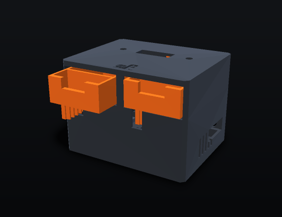

  

### One person, five places on the map.

I'm **Piyush — Pi for short.** One week I'm flying a drone over a coffee estate. The next I'm writing firmware for a drawer, shipping a website, cutting a film, or fixing a server at 2 am. I stopped trying to pick one.

This page is the map. Start anywhere.

[**01 Air**](#01--air) &nbsp;·&nbsp; [**02 Web**](#02--web) &nbsp;·&nbsp; [**03 Bench**](#03--bench) &nbsp;·&nbsp; [**04 Edit**](#04--edit) &nbsp;·&nbsp; [**05 Rack**](#05--rack) &nbsp;·&nbsp; [**All repositories ↗**](https://github.com/Piyushmishra29?tab=repositories)

 

## 01 · Air

**I turn drone flights into maps people can act on.** This is the newest part of the map and the one growing fastest.

It runs under my own brand, **MapMyAcre**: land surveys for people who own land. A flight goes up over an estate. What comes down is a measured boundary, a stitched aerial map, contours, and a 3D model of the land that opens in a browser.

| From one flight | What it is |
| :--- | :--- |
| **Boundary** | The plot outline, measured in hectares, in the formats surveyors and compliance teams already use. |
| **Aerial map** | Hundreds of photos stitched into one image accurate enough to measure on. |
| **3D model** | The estate as terrain you can orbit, zoom and share as a link. |
| **Run planner** | Which estates are mapped, which are flown, and which are left to fly. |

Lately that has meant coffee estates in the Western Ghats, where a clean boundary is what deforestation-free export rules ask for.

WEBODM · QGIS · GDAL · THREE.JS · LEAFLET · PYTHON

 

## 02 · Web

**Sites that move, and tools that run on your own server.**

| Build | What it does |
| :--- | :--- |
| [**Liquid Storefront ↗**](https://github.com/Piyushmishra29/liquid-storefront) | Runs a Shopify theme on your own server. Cart, admin, payments, your data. |
| [**The Cabinet ↗**](https://github.com/Piyushmishra29/bar-inventory) | A motion site for a private bottle collection, in 3D. |
| [**South Coast '26 ↗**](https://github.com/Piyushmishra29/south-coast-26) | A zine-style site for eight days down Sri Lanka's south coast. |

Most of the client work lives in private repos: resort and homestay sites, a car-audio showroom with a build-sheet quiz, a film studio, and a set of self-hosted team tools.

TYPESCRIPT · NEXT.JS · ASTRO · REACT THREE FIBER · GSAP · POSTGRESQL

 

## 03 · Bench

**Where software leaves the screen.**

[**Shopkeeper ↗**](https://github.com/Piyushmishra29/shopkeeper) — enter a PIN, a drawer opens, the pick gets logged. A working tool-cabinet demonstrator built from firmware and filament.

| Build | What it does |
| :--- | :--- |
| [**NPK Dash ↗**](https://github.com/Piyushmishra29/npk-dash) | Turns a real soil probe's Modbus registers into a live dashboard. |
| [**OPS Sensor Unit ↗**](https://github.com/Piyushmishra29/ops-sensor-unit) | An ESP32 air-quality monitor in a custom printed case. |
| [**Pi Weather Ops ↗**](https://github.com/Piyushmishra29/pi-weather-ops) | A Raspberry Pi sensor station dressed as an ops panel. |
| [**Biome Mini ↗**](https://github.com/Piyushmishra29/biome-mini) | A tiny OLED watching the air and a thirsty plant. |
| [**Gridfinity Drawer ↗**](https://github.com/Piyushmishra29/gridfinity-drawer) | Parametric baseplates made to fit an actual drawer. |
| [**Paperwitch ↗**](https://github.com/Piyushmishra29/paperwitch) | A Kindle with other plans. |

ESP32 · MICROPYTHON · RASPBERRY PI · PARAMETRIC CAD · 3D PRINTING

 

## 04 · Edit

**Cameras came first.** Ad films, event reels and a lot of drone footage, long before the mapping.

| Build | What it does |
| :--- | :--- |
| [**Reel Edit Pipeline ↗**](https://github.com/Piyushmishra29/reel-edit-pipeline) | Turns event and drone footage into beat-synced reels, rendered on the GPU. |
| [**Tuk & Tide Surf Club ↗**](https://github.com/Piyushmishra29/tuk-and-tide-surf-club) | A heritage identity, brand book and sticker pack, built from code. |
| [**Bro Knows A Spot ↗**](https://github.com/Piyushmishra29/bro-knows-a-spot) | A sunburst identity for a travel company. |

FFMPEG · NVENC · DAVINCI RESOLVE · WEASYPRINT

 

## 05 · Rack

**I host my own things.** A small fleet of servers, a Raspberry Pi and the machines at home, on one private network. Client sites, databases, backups and team tools all run there.

It is mostly private, and mostly boring on purpose: one security baseline on every server, a health check every morning, backups that get pulled and tested.

LINUX · DOCKER · CADDY · NGINX · TAILSCALE · GITHUB ACTIONS

 

---

OFF THE MAP: <a href="https://github.com/Piyushmishra29/mete">a dot-matrix focus timer</a> · <a href="https://github.com/Piyushmishra29/bing-bong">an airline chime for finished prompts</a>
